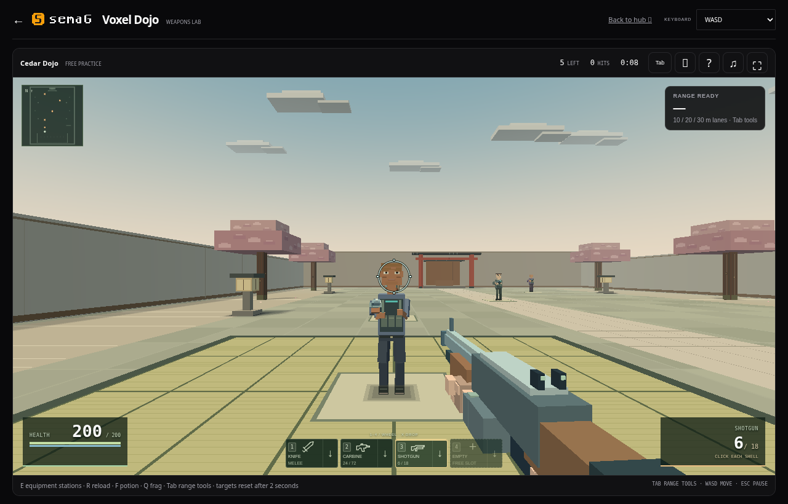

# Voxel weapon reticles

Breach, Royale, Last Stand, bot practice and the Dojo share weapon-specific reticles.

| Equipment | Aim cue |
| --- | --- |
| Sidearms | Fine arms and a central dot |
| SMGs | Compact cross and square center |
| Rifles | Open cross |
| Precision rifles and snipers | Fine cross and small dot; scoped guns use their actual scope when aimed |
| Machine guns | Heavier arms and an open square center |
| Pellet shotguns | Spread ring and short ticks |
| Solid-slug shotgun | Open diamond |
| Crossbow | Diamond center with open arms |
| Blades | Small open diamond |

The gap follows the weapon's real spread, including velocity, airborne accuracy, firing bloom and the accepted trigger mode. Classic's alternate volley changes its cue; Bucky's alternate ring describes its distant pellet fan after the airburst opens. The ring is an accuracy guide, not a guaranteed impact boundary or projectile prediction.

The center stays at the middle of the game viewport. Only the gap expands and settles, smoothly at the display's refresh rate. ADS uses the actual camera zoom and aim transition. Changing weapons or reopening play clears the previous gap; menus, supplies, healing, released controls and eliminated players hide their aim cue. Reduced-motion settings use the current gap directly.

Gold flashes still confirm headshots and orange flashes confirm body or leg damage. These effects require real accepted health loss and do not move the aim point.

